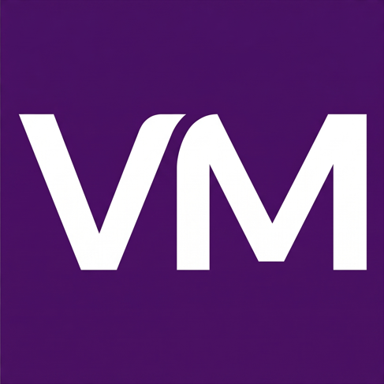

<div align="center">
  
  <h1>Victor Morais | Portfolio</h1>
  <p>
    <strong>Product Designer | UX/UI | UX Research</strong><br/>
    Um portfólio completo em SPA (Single Page Application) com suporte nativo a múltiplos idiomas e arquitetura moderna orientada a componentes.
  </p>

  <p>
    <a href="https://reactjs.org/"></a>
    <a href="https://vitejs.dev/"></a>
    <a href="https://www.framer.com/motion/"></a>
    
  </p>
</div>

---

## 🌍 Internacionalização
O portfólio suporta 3 idiomas nativos, selecionáveis diretamente pela interface:
- 🇧🇷 **Português (PT-BR)**
- 🇺🇸 **Inglês (EN)**
- 🇪🇸 **Espanhol (ES)**

A infraestrutura garante que **o mesmo componente sirva diferentes idiomas**, com traduções estáticas centralizadas nos arquivos `Locales` (Ex: `src/data/vivoPayLocales.jsx`).

---

## 🚀 Como Executar

O projeto utiliza **Node.js** e **Vite** para um ambiente de desenvolvimento ultrarrápido.

```bash
# Instale as dependências
npm install

# Inicie o servidor de desenvolvimento (geralmente em localhost:5173)
npm run dev

# Para criar o build de produção
npm run build
```

---

## 📂 Arquitetura do Projeto

O projeto foi refatorado para uma **arquitetura limpa e orientada a componentes**. O fluxo principal da aplicação atua apenas como uma camada de orquestração de componentes reutilizáveis.

### 🧩 Principais Componentes de UI (`src/components/`)
* **`ProjectsGallery.jsx`**: Componente de galeria com suporte a filtro por tags e lógica de "Ver Mais".
* **`ExperienceSection.jsx`**: Linha do tempo profissional e CTA de download do currículo.
* **`CaseHero.jsx` / `CaseOverview.jsx` / `CaseCTA.jsx`**: Blocos modulares padronizados que constroem visualmente as páginas de *Case Study*.

---

## 💼 Case Studies Disponíveis

Atualmente, o portfólio conta com 4 estudos de caso aprofundados implementados em código (além dos projetos listados no currículo):

| Projeto | Setor / Tags Principais | Status |
|---|---|---|
| **VivoPay** | Fintech, Cartão de crédito, B2C, Mobile, APP | ✅ Completo (PT/EN/ES) |
| **SportingBet** | Betting, B2C, Research, Mobile First, Legal | ✅ Completo (PT/EN/ES) |
| **Bradesco** | Fintech, B2B, Research | ✅ Completo (PT/EN/ES) |
| **TradersClub (TC)** | Fintech, B2B, Investimentos | ✅ Completo (PT/EN/ES) |

---

## 📚 Documentação Adicional

O projeto conta com uma suíte de documentação robusta para manter a manutenibilidade:
- [**DEVELOPMENT.md**](./DEVELOPMENT.md) — Stack, arquitetura detalhada e gerenciamento de estado.
- [**DESIGN.md**](./DESIGN.md) — Design Tokens, variáveis CSS e padrões visuais.
- [**CASES-PATTERN.md**](./CASES-PATTERN.md) — Guia de implementação e padronização para novos Case Studies.
- [**CHANGELOG.md**](./CHANGELOG.md) — Histórico de mudanças do projeto.

---

## 🖨️ Geração Dinâmica de PDFs

Para enviar o material de forma offline, o projeto possui um script em **Puppeteer** que navega pelos Case Studies em React e gera PDFs estáticos com alta fidelidade de design, e os salva em `/public`.

**Como usar:**
1. Certifique-se de que o servidor local está rodando (`npm run dev`)
2. Em outra aba do terminal, rode:
```bash
node scripts/generate-pdfs.js <slug-do-case>
# Exemplo: node scripts/generate-pdfs.js vivo-pay
```

---

## 📞 Contato

<p>
  <a href="https://wa.me/5511951565851"></a>
  <a href="https://br.linkedin.com/in/victorhugon"></a>
  <a href="mailto:victor9009@gmail.com"></a>
</p>
